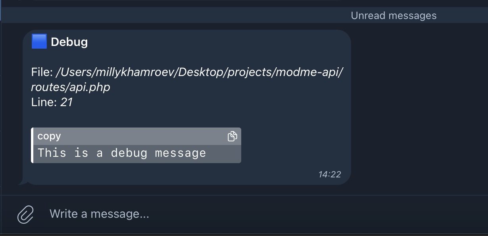

<h1 align='center'><samp>LARALOG</samp></h1>
<h3 align='center'>
    <sup align='center'>PHP Laravel package to debug and handle logs via telegram bot</sup>

[//]: # (    <h6 align="center"><a href="">Check it out how easily you can send me a message</a></h6>)
</h3>
<p align='center'>
  <a href='https://github.com/Mirmuxsin/laralog/blob/master/license'></a>
  <a href='https://packagist.org/packages/milly/laralog'></a>
  <a href='https://www.patreon.com/millykhamroev'></a>
</p>

## Requirements
- PHP 7.3 or higher
- <a href="https://github.com/Mirmuxsin/laragram">Laragram package </a> ^2.0|^3.0

## Installation
#### Install the package via composer
```bash
composer require milly/laralog
```
#### Publish the configuration file
```bash
 php artisan vendor:publish --tag=laralog-config
```
#### Add the following environment variables to your `.env` file or set them in the `config/laralog.php` file
```bash
TELEGRAM_BOT_TOKEN=1234567890:ABCDEFGHIJKLMNOPQRSTUVWXYZ
TELEGRAM_CHAT_ID=-1234567890
```

## Methods
#### The package provides the following methods to send log messages to the telegram bot
- `Laralog::debug(int|string|array|object $message)`
- `Laralog::info(int|string|array|object $message)`
- `Laralog::warning(int|string|array|object $message)`
- `Laralog::error(int|string|array|object $message)`

## Usage
#### Send a log message to the telegram bot
```php
use Milly\Laralog\Laralog;

// call statically
Laralog::debug('This is a debug message');

//call instance
$laralog = new Laralog();
$laralog->info('This is an info message');
```

And you will receive a message in your telegram bot with the debug message like this:


## Development mode
#### By default, the package is in the development mode, which means that it will send messages only if the `APP_ENV` is set to `local`. If you want to send messages in the production mode, you need to set the `is_enabled` key to `true` in the `config/laralog.php` file
```php
return [
    'is_enabled' => true,
    'telegram_bot_token' => env('TELEGRAM_BOT_TOKEN'),
    'telegram_chat_id' => env('TELEGRAM_CHAT_ID'),
];
```

## License
This package is open-sourced software licensed under the [MIT license](https://opensource.org/licenses/MIT).


